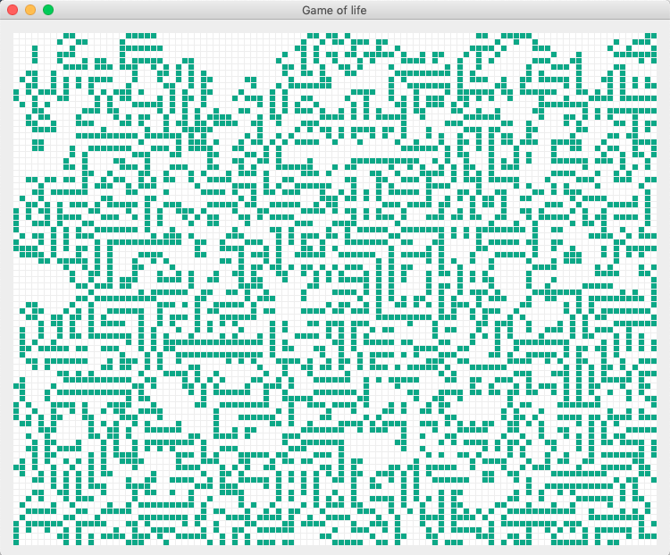

# GameOfLife
Java implementation of https://en.wikipedia.org/wiki/Conway%27s_Game_of_Life using Graphics library

Steps to Run
- Build with maven and Java8
- Execute follow command to run the game:
    java -jar target/experiment.gameoflife-0.0.1-SNAPSHOT.jar
- The program will run forever. It'll start anew as soon as the final state is reached.
- To stop the program, just kill the program.
- You can edit the Constants.java file to change grid size or cell size or even the initial population threshold params (INIT_MAX_LIVE_CELLS_PERCENT & INIT_MIN_LIVE_CELLS_PERCENT)
- Same screenshots:

